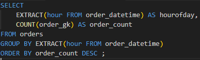

Analyzing with SQL!
-------------------------
Here's my approach using SQL to analyzing this dataset to uncover business insights that can inform better decision-making:

Approach:
---------
1.>
--------------------------------------------
Looked into the Distribution of orders according to reasons for failure,
i.e cancellations before and after driver assignment.\
Query:

Output snippet:

**Explaination:**\
It has been observed that a significant number of clients canceled their orders before a driver was assigned. This implies that customers may have waited too long for a driver to be assigned.

Query:

Output snippet:

**Explaination:**\
The majority of cancellations are due to being cancelled by the client, with 2811 ,4496 orders However, cancellations by the **system(rejected)** are more frequent compared to after driver assignment, with 3406 orders.

2.>
-------------------------------------------------------
Looked into the distribution of failed orders by hours. Is there a trend that certain hours have an abnormally high proportion of one category or another? What hours are the biggest fails?\

Query:

Output snippet:

Query:

Output snippet:

Query

Output snippet

Query

Output snippet

**Explaination:**\
 It appears that the highest number of failed orders occurred at 8:00, followed by 21:00 and 23:00. \
 Upon deeper analysis, it is evident that the primary reason for these cancellations is that most orders were canceled by clients due to a lack of driver assignment. Additionally, all system-initiated cancellations were due to driver unavailability.

3.>
--------------------------------------------------------------
Average time to cancellation with and without driver, by the hour.

Query:

Output snippet:

**Explaination:**\
The average cancellation time is consistently higher for orders with an assigned driver, it  indicate delays or inefficiencies in driver assignment processes. identify peak hours of cancellation activity 5:00AM.

4.>
-------------------------------------------------
Looked into the average ETA(Estimated Time of Arrival) by hours,average time it takes for an order to arrive (ETA) for each hour of the day

Query:

Output snippet:

**Explaination:**\
The bar chats very closely matches the count of failed orders per hour, indicating that the number of failed orders increases as the average waiting time of the client increases.

5.>
----------------------------------------
Distribution by location to identify areas with high demand

Query:

Output snippet:

**Explaination :**
Popular Pickup Locations with 53 cancelled order 

