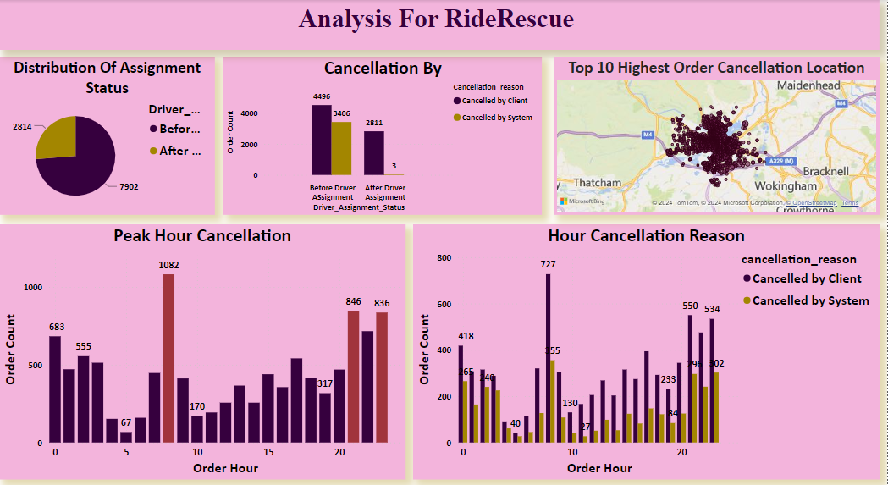
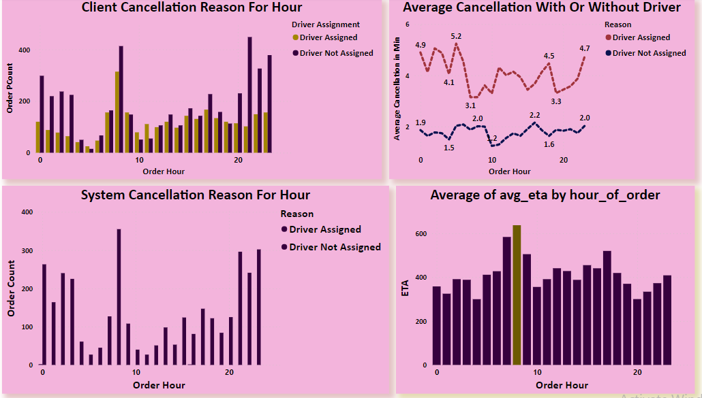

:RideRescue:
=================================
In a one-on-one call this morning, my manager informed me that the leadership team wants to analyze unsuccessful order completions in the GetTaxi application so that they can improve upon there alogirithm. 

Task: 
-------------------------------------
To investigate various metrics for orders that did not complete successfully, 
i.e. where the customer didn't end up getting a car. 

The goal is to enhance algorithm efficiency by analyzing various metrics, leading to improved ride assignments and heightened customer satisfaction within the Gett application's.

To address this, I have performed some analysis  using SQL and  below is the Visulaization of that :

Visualization Of output:
-------------------------------

Key Insight:
------------------------------------
**1. Long Wait Times Before Driver Assignment:**\
The observation of a high number of cancellations before a driver is assigned ,suggests that customers may have experienced extended wait times, leading them to cancel their orders . This highlights the importance of reducing wait times for order assignment to improve customer satisfaction and retention.

**2. Peak Failures at Specific Hours:**
 The identification of peak failures at 8:00, followed by 21:00 and 23:00 across all categories indicates consistent trends in cancellation patterns. Understanding these peak periods can help in implementing targeted strategies to address issues during these times and improve service reliability.

**3. Higher Average Cancellation Time with Assigned Driver:**
 The observation that the average cancellation time is higher with an assigned driver compared to without for each hour, with a peak at 5:00, suggests delays in driver assignment leading to increased cancellation rates. Addressing these delays and improving the efficiency of the driver assignment process can help reduce cancellations and enhance customer experience.

**4. Correlation Between Order Cancellations and ETA:**
 The increase in order cancellations with increasing ETAs, particularly with the highest ETAs occurring at 8:00, highlights the impact of longer wait times on customer behavior. Reducing ETAs, especially during peak hours, can help mitigate cancellations and improve service reliability.

Based on these insights, here are some recommendations to reduce cancellations and improve service quality:

Recommendation:
--------------------------------

- Implement measures to reduce wait times, particularly during peak hours such as rush-hour periods.
- Offer incentives to encourage more drivers to be available during high-demand times, thereby reducing ETAs and improving service reliability.
- Optimize the driver assignment process to ensure timely matching of drivers with orders, reducing wait times for customers.
- Enhance communication with customers by providing real-time updates on order status and ETA, managing expectations and reducing uncertainty.
- Continuously monitor cancellation rates and customer feedback to identify areas for improvement and implement targeted interventions to address customer pain points.

By implementing these recommendations, businesses can enhance customer satisfaction, 
reduce cancellations, and strengthen their competitive position in the ride-hailing market.

Please review my SQL query snippet for accuracy...

ThanK You!

