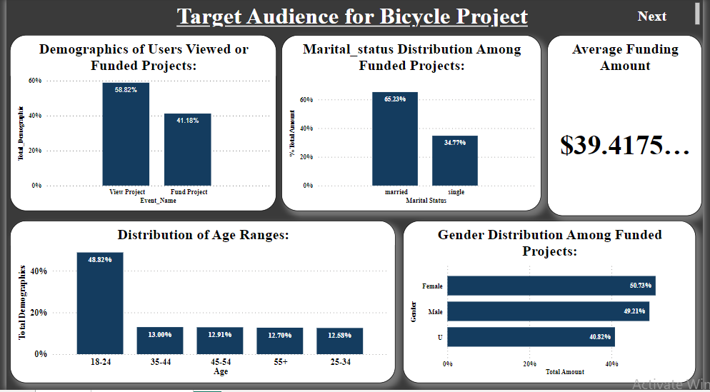
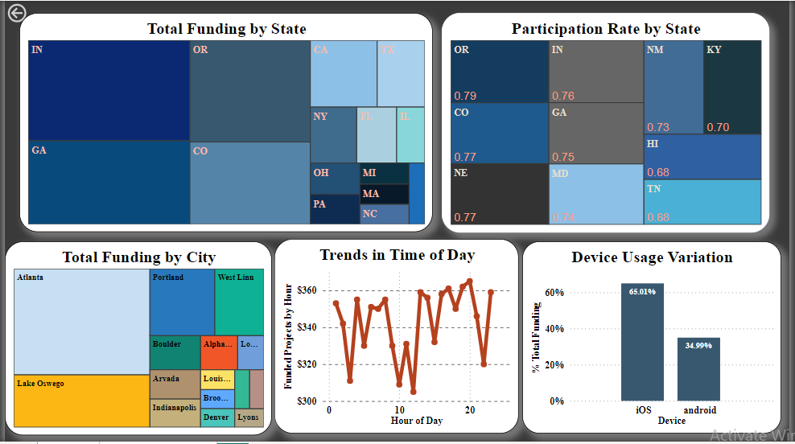

TARGETED USER SEGMENTATION FOR BICYCLE PROJECT FUNDING :
=========================================
Introduction:
------------------
 I've analyzed analytics data from BootLoader a mobile app that helps people crowdfund their creative projects (fictional crowdfunding mobile app) , determine what kinds of users would be interested in a new bicycle project.
 
 Task Description:
 --------------------
 Dennis Ridesalot, a BootLoader user, has a new concept for a 3-speed bicycle made from recycled parts with a $20 price point. The BootLoader team wants to send a push notification to their users, prompting them to fund the project. \
 However, they don’t want to send a message to all of their users -- only those who they think would be interested.

 Aim:  
 create a visualization that helps answer: what kinds of users would be interested in the bicycle project?

 So push notification can be send to segments of users, based on attributes like location, age range, gender, and mobile device.

Data Overview:
==========================
The provided dataset consists of 50,000 events tracked over one month, including "View Project" and "Fund Project" events. Each event contains attributes such as category, client_time, amount (for funded projects), and user demographics (e.g., age range, gender, location).

Approach:
------------------------------
I've approached this task by analyzing user demographics, behavior patterns, and funding trends. \
I’ve made a list of questions that I will try to answer with different types of visualizations.

* What are the demographics of users who have viewed or funded projects in the "Sports" and "Environment" categories?
* What is the distribution of age ranges among users who have shown interest in projects related to "Sports" and "Environment"?
* How does the gender distribution differ among users who have funded projects in the "Sports" and "Environment" categories?
* Which cities and states have the highest participation rates in funding projects related to "Sports" and "Environment"?
* Are there any trends or patterns in the time of day or day of the week when users are most likely to fund projects in the "Sports" and "Environment" categories?
* How does the device usage (iOS vs. Android) vary among users who have funded projects in the "Sports" and "Environment" categories?
* Is there a correlation between marital status and the likelihood of funding projects in the "Sports" and "Environment" categories?
* Are there any geographical clusters or regions where users are more likely to fund projects related to "Sports" and "Environment?

Solution:
------------

The first dashboard aims to identify the target audience segments for our crowdfunding platform. It provides insights into the demographic composition, preferred devices, age distribution, viewership versus funding behavior, and the variation in funding across gender out of total for each group of gender and marital status. 

By understanding these segments, we can tailor our outreach efforts to effectively engage with our target audience.

The second dashboard focuses on analyzing funding amounts by state to identify priority areas for our crowdfunding efforts. By examining funding levels across different states and cities, as well as the participation rates by state, we can pinpoint regions with higher potential for funding. This information helps us strategize our outreach efforts more effectively.

Additionally, the time series visualization displays funding counts over time, allowing us to identify peak hours for funding. This insight helps us optimize our messaging strategies, such as sending targeted text messages to users during peak funding hours. Furthermore, understanding device usage patterns helps us prioritize which devices to focus on for our outreach campaigns

Recommendation:
===============================

* Targeting Age Group and Gender: \
We should focus on the age group of 18-24 as they show more interest in the bicycle project compared to other age groups. When it comes to funding, there isn't a significant difference based on gender, so we can target all gender groups. However, it's worth noting that targeting married individuals may lead to more fruitful outcomes.

* Geographic Focus: \
States like Indiana (IN) and Georgia (GA) are providing more funding for bicycles. I would recommend starting with Georgia or Oregon (OR) as they have a higher participation rate and City compared to other states. Specifically, Atlanta is the city providing the maximum funds in Georgia.

* Peak Hour Messaging: \
We can send push messages to users during peak funding hours to maximize engagement.\
 For example, in Oregon(OR), the peak funding hour is 4:00 PM. Additionally, we should prioritize messaging for iOS users, as they seem to be more active during these peak hours.

Conclusion:
-------------------

In summary, targeting the 18-24 age group,Married , focusing efforts on high-funding states like Georgia, particularly in cities such as Atlanta, and leveraging peak funding hours for strategic messaging can optimize the success of the bicycle project on BootLoader.

Thank You!
--------------

